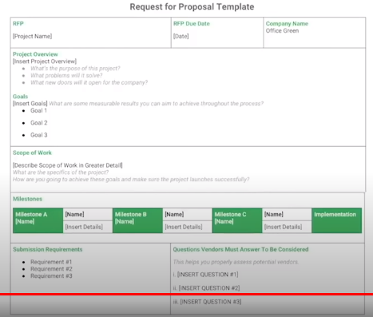

Budget is broken down by milestones.

## Resource Cost Rates

- labor
- tools
- equipment
- software

## Reserve Analysis

Look for unaccounted project resources.

## Cost of Quality

- prevention costs
- appraisal costs
- internal failure costs
- external failure costs

# Estimate Budget

- look at previous similar projects
- talk to experienced project managers
- look at each component from the bottom up and add up the costs of each task
- get quotes from vendors
- add contingency budget
- add tax
- get approval from key stakeholder

Fixed Costs
Travel Expenses
Buffer is around 5% of total project cost.
Reserves

Establish Baseline
Amount to compare if project is below or over budget.

Track planned cost vs actual cost.

Goal is to get estimate cost as close to actual cost as you can.

# Monitor Budget

Fixed contracts are paid when milestones are reached.

Time and material contracts are paid monthly. These are based on hours worked and include incidentals such as travel and lodging.

Establish a sign off plan.
Inform appropriate stakeholders of any changes.
Manage changes as they occur.
Decide with key stakeholders what budget overruns are acceptable such as 1% or 10%.

# Procurement

- Initiation : decide on what is needed (NDA)
- Selection : decide on specific providers, services, and supplies (RFP)
- Contracts : draft and sign (SOW)
- Control : set up logistics for monitoring and maintaining quality
- Completion : measure success of procurement

In agile procurement the team is involved in the decision process and the procurement can change as the project progresses.

In traditional procurement the project owner chooses providers and sets fixed schedules for services and supplies allowing for a clear timeline with set deadlines.

NDA : non disclosure agreement
RFP : request for proposal
SOW : statement of work

RFP

