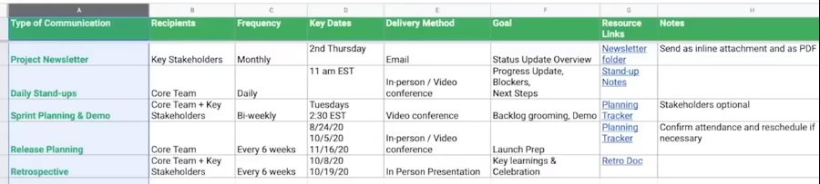
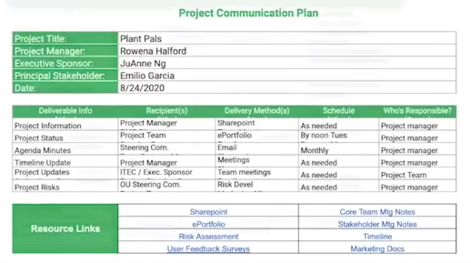
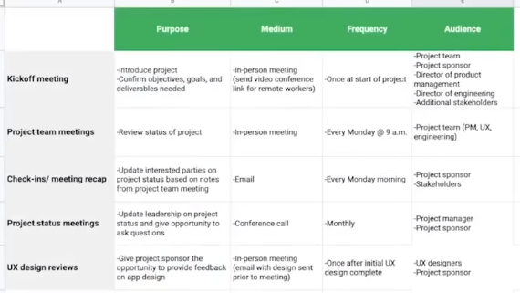

Communication includes

- emails
- status updates
- newsletters
- phone calls
- documents
- daily stand ups
- weekly check ins
- meetings
- presentations

# Communication Plan

A document that outlines communication between the team for a project.

- what needs to be communicated
- who needs to communicate
- when communication happens
- why communicate
- how to communicate
- where to store communicated information

The actual format can be anything you like as long as what's above is covered.

Communication Plan example i

- Type : What type of communication will be delivered.
- Frequency : How often to communicate.
- Recipients : Who will receive the communication.
- Dates : When the communication will occur.
- Delivery : How will the communication be delivered.
- Goal : What the communication hopes to achieve.
- Owner : Person responsible for delivering the communication.
- Links : Lead to where the information is stored.

Communication Plan example ii

Communication Plan example iii

# Identify Recipients

Use a [RACI Matrix](RACI%20Matrix.md) and [Stakeholder Interest Matrix](Stakeholder%20Interest%20Matrix.md) to identify who needs to receive the communications.

# Follow Up

Not everyone responds to the same form of communication.
To track communication effectiveness send an email or poll.

- what is working
- what is not working
- where can improvements be made

# Information Storage

- store in a central hub that is easy to access
- not everyone needs access to the full documentation
- provide adequate level of detail for different stakeholders
- allow for access when you are not available or need to transfer ownership
- protect sensitive data
- protect personal information
