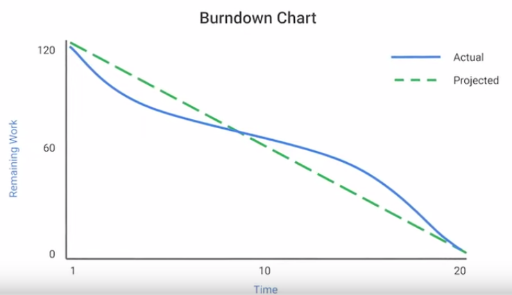
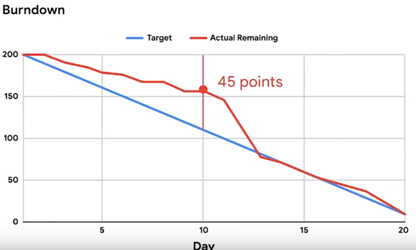

A chart that visualizes the work completed against the work that still needs to be completed in terms of time. It offers a granular view of each task.

Use when finishing the project on time is the top priority.

A burndown chart showing Effort vs Day.

The target line shows a target of completing 10 effort points per day.

At day 10 there should be 100 points completed but the actual work done shows 45 points completed. This indicates the team is behind schedule in terms of accomplished work.

Around day 12 the team is back on track in terms of accomplished work.
