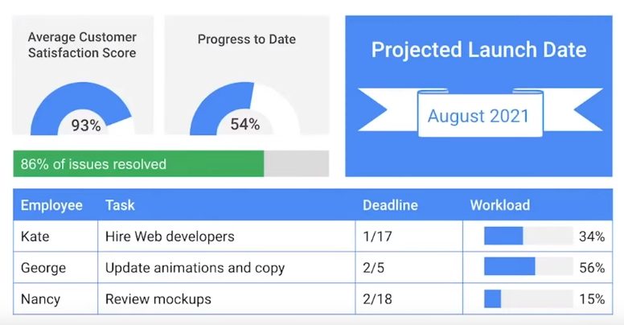

A dashboard is snapshot displaying the project's health.

Instead of presenting a table of individual data points, present the average satisfaction score. 

Some useful data to display

- project progress to date
- completion rates
- countdown timers to important launches
## Static

A static dashboard displays the status of the project at a particular point in time.
## Dynamic

A dynamic dashboard continuously updates the status of the project as changes occur.
