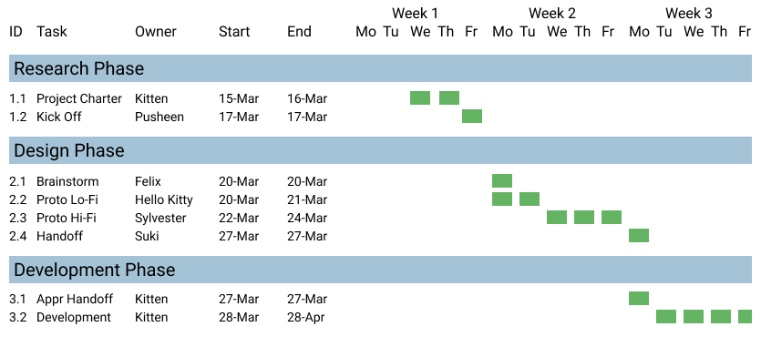

A visual representation of the project's tasks and milestones.

It includes at minimum

- duration of each task
- dependencies between tasks
- milestones

You can include swim lanes for different teams or phases.

Phases : Research , Design , Development

As a spreadsheet.
Phases : Initiation , Planning , Execution , Quality

