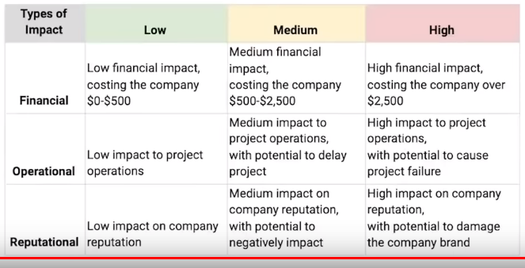

# Project Title

**Author :**
**Status :** Draft / Final
**Created :**
**Updated :**

---
# Objective

To outline the risks to the project and the plans to mitigate those risks.

---
# Executive Summary

(include the normal conditions of the project and the expected outcomes under those conditions)

We expect to launch the landing page for GTD around the end of November. This includes a sign up form for a waiting list for interested users.

Following are the risks to the project and the mitigation plan to address them.

---

(include a risk register, for each risk identified)

Risk : Vendor at risk of not meeting milestone.

|Description|Risk Rating|Mitigation|
|--|--|--|
|vendor one day behind schedule|low|check in with vendor and help remove blocks|
|vendor far behind schedule|medium|hold daily check ins, get scheduled updates, remove blocks|

---
# Appendix

**Impact Chart**

